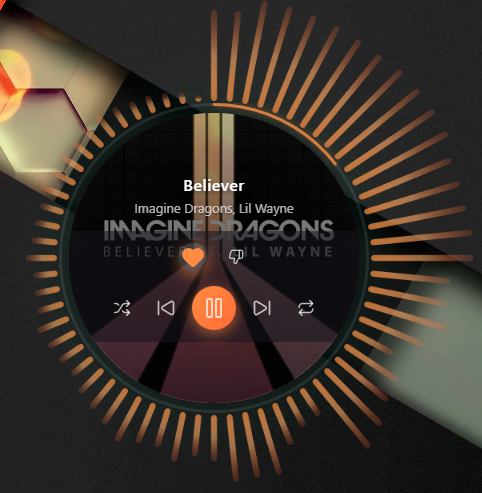
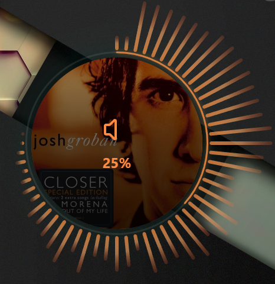

# Round Sound Widget

A circular music widget for Windows with real-time audio level visualization.  


     


## Features

- 🎵 Track information display (title, artist, album cover)
- 🎮 Media controls (play/pause, next, previous, shuffle, repeat, like/dislike)
- 📊 Audio level visualization with "rays" around the widget (real-time FFT analysis)
- 🖼️ Circular progress bar with interactive thumb (drag-to-seek)
- 🪟 Transparent frameless window at desktop level
- 💾 Window position persistence between restarts
- 🎨 Customizable color scheme
- ⚙️ Settings with dynamic FFT parameters
- 🔔 System tray integration (minimize to tray instead of closing)
- 🚀 Auto-start on Windows startup

## Technologies

### Backend
- **Go 1.21+**
- **Wails v2** — desktop application framework
- **gorilla/websocket** — WebSocket for WebNowPlaying
- **go-wca** — WASAPI for audio level capture

### Frontend
- **Vue.js 3** + Composition API
- **TypeScript**
- **Vite 7**
- **Lucide Icons**
- **Canvas** for audio levels

## Project Structure

```
round-sound/
├── main.go                 # Wails entry point
├── wails.json              # Wails configuration
├── go.mod                  # Go module
├── app/
│   ├── app.go              # Main application logic
│   ├── config.go           # Configuration management
│   ├── window.go           # Window manager (cross-platform)
│   └── window_windows.go   # Windows-specific code (HWND_BOTTOM)
├── media/
│   ├── types.go            # Player data types
│   ├── webnowplaying.go    # WebSocket server for WebNowPlaying
│   └── audiolevels.go      # WASAPI audio capture
├── frontend/
│   ├── src/
│   │   ├── main.ts
│   │   ├── App.vue
│   │   ├── components/
│   │   │   ├── CircularWidget.vue
│   │   │   ├── AlbumCover.vue
│   │   │   ├── TrackInfo.vue
│   │   │   ├── ProgressRing.vue
│   │   │   ├── AudioLevelsRays.vue
│   │   │   └── MediaControls.vue
│   │   ├── composables/
│   │   │   ├── useMediaPlayer.ts
│   │   │   └── useAudioLevels.ts
│   │   └── types/
│   │       └── index.ts
│   ├── package.json
│   └── vite.config.ts
└── docs/
    ├── todo.md
    └── WebNowPlaying-Protocol.md
```

## Installation & Usage

### Requirements
- Go 1.21+
- Node.js 20+
- Wails CLI (`go install github.com/wailsapp/wails/v2/cmd/wails@latest`)

### Development
```bash
# Install dependencies
cd frontend && npm install && cd ..
go mod tidy

# Run in dev mode
wails dev
```

### Build
```bash
wails build
```

## WebNowPlaying Integration

The widget works with the [WebNowPlaying](https://wnp.keifufu.dev/) browser plugin:
1. Install the plugin in Chrome/Firefox
2. Launch Round Sound
3. Open the extension settings
4. Click "Add custom adapter" and enter the port from Round Sound settings (default: 8974)
5. Enable the adapter
6. Play music on YouTube Music, Spotify Web, or any other supported service

### Custom Adapter (Rainmeter Compatibility)

If you also use Rainmeter with WebNowPlaying.dll, the default port 8974 will be busy.  
Round Sound automatically detects this and offers to use a different port:

1. When port conflict is detected, settings open automatically
2. Change the port (e.g., to 9000)
3. Add this port as a Custom Adapter in the browser extension
4. Both Round Sound and Rainmeter will work simultaneously

### Supported Sources
- YouTube Music
- Spotify Web
- SoundCloud
- Deezer
- Tidal
- Apple Music
- And more...

## Implementation Details

### Desktop-Level Window
The widget is displayed at the desktop level (below all windows) using:
- Windows API `SetWindowPos` with `HWND_BOTTOM`
- Periodic Z-order check every 500ms

### Partial Updates

WebNowPlaying sends only changed fields. The backend maintains full state in memory and performs merge operations.

### Audio Levels (WASAPI)

Sound visualization works through the Windows Core Audio API:

- Audio stream capture via WASAPI loopback (`IAudioCaptureClient`)
- Real-time FFT analysis using `github.com/mjibson/go-dsp/fft`
- Hann window application to reduce spectral leakage
- Grouping FFT bins into 64 frequency bands (20Hz - 20kHz) with logarithmic scale
- Dynamic FFT size configuration (1024/2048/4096/8192) and frequency range
- Data transmission to frontend at ~60 FPS via Wails Events

### Port Conflict Resolution

If the default port 8974 is busy (e.g., by Rainmeter WebNowPlaying.dll):
1. The settings panel opens automatically
2. Auto-scrolls to the WebNowPlaying section
3. User can set a custom port (e.g., 9000)
4. Instructions for adding Custom Adapter are displayed

## License

MIT
